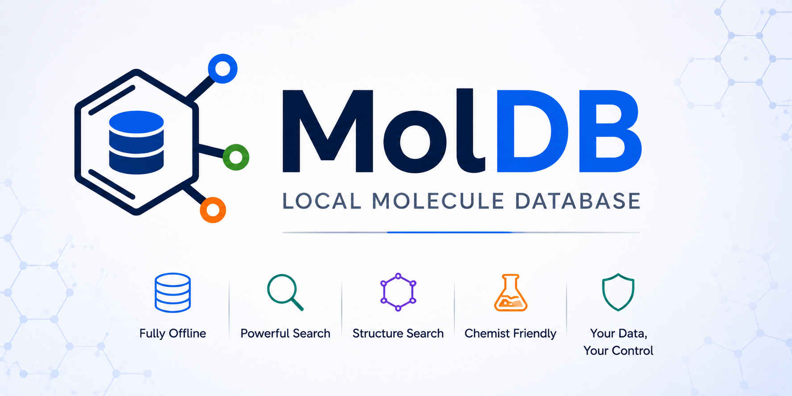
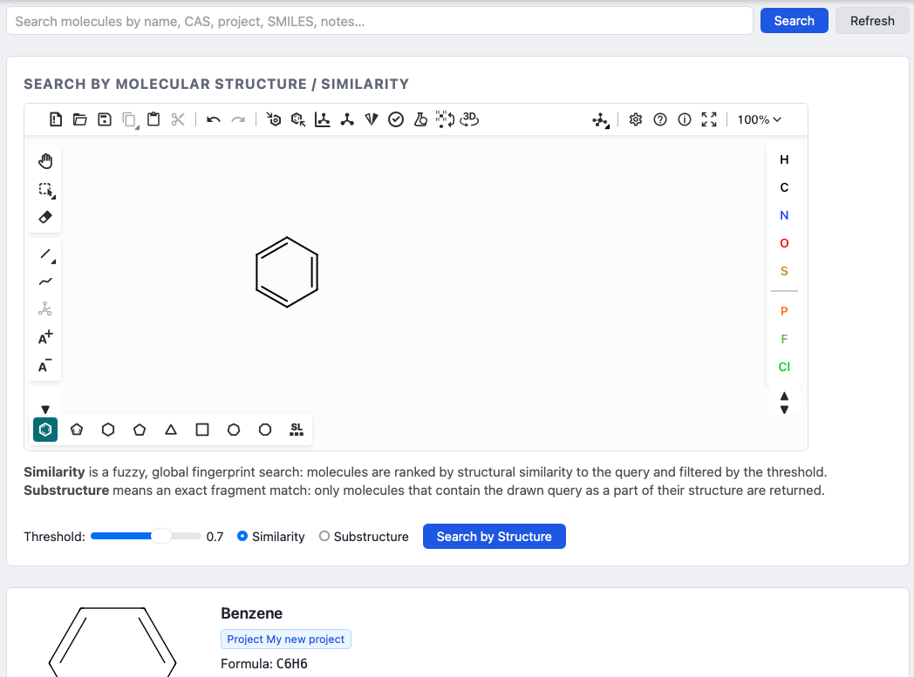
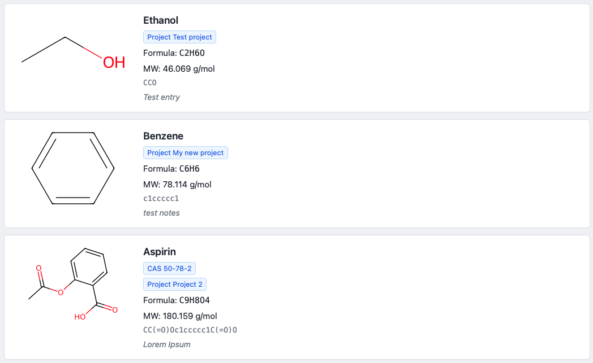
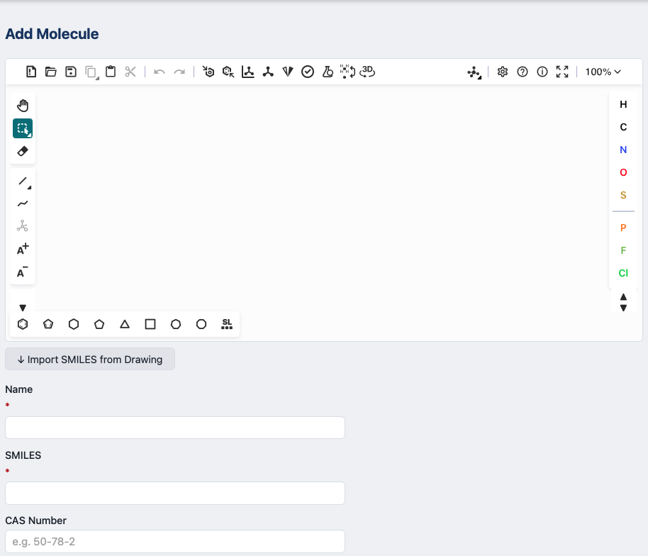

# MolDB — Local Molecule Database

<p align="center">
  
</p>

<p align="center">
  <strong>Fully Offline Molecule Database for Chemists</strong>
</p>

A fully offline Python + web UI application for managing a chemistry molecule database.

---

# Screenshots

## Molecule Browser and Structure Search



> Browse, filter, and manage your local molecule collection with fast offline search.
> Perform exact, similarity, and substructure searches using the integrated structure editor.

---

## Molecule Detail View



> Inspect molecular structures, identifiers, properties, and generated 2D depictions.

---

## Molecule Editor



> Add or edit molecules with validation, duplicate detection, and RDKit-powered processing.

---

# Quick Start

## 1. Install dependencies

```bash
# Recommended: use conda for RDKit
conda create -n moldb python=3.11 rdkit -c conda-forge -y
conda activate moldb
pip install -r requirements.txt
```

## 2. Run the app

```bash
python run.py
# Opens http://localhost:8000 in your browser automatically
```

The SQLite database is not created automatically unless you explicitly create one in advanced mode. On first run, use the UI to select an existing `.sqlite` file or, in advanced mode, create a new database and apply schema migration.

The `MOLDB_PATH` environment variable is optional and only useful for development; packaged executables should use the UI file picker instead.

## 3. Run tests

```bash
pytest tests/
```

---

# Features

- Add / edit / delete molecules
- Search by:
  - Name (fuzzy)
  - CAS number
  - Exact SMILES
- Structure similarity search (Tanimoto)
- Substructure search via Kekule.js drawing widget
- 2D structure visualization (RDKit SVG rendering)
- Duplicate detection via InChIKey
- Fully offline operation
- Interactive API documentation

---

# Build Windows .exe

```bash
conda activate moldb
pip install pyinstaller

cd build
pyinstaller moldb.spec --clean

# Output:
# dist/MolDB.exe
```

---

# Project Structure

```text
project-root/
├── moldb/                  # Core library (importable)
├── ui/                     # FastAPI app + static frontend
├── tests/                  # Pytest suite
├── build/                  # PyInstaller spec + RDKit hooks
├── docs/
│   └── screenshots/
│       ├── banner.png
│       ├── molecule-browser.png
│       ├── molecule-detail.png
│       ├── structure-search.png
│       ├── molecule-editor.png
│       └── api-docs.png
├── run.py                  # Entrypoint
└── README.md
```

---

# API Docs

Run the application and visit:

http://localhost:8000/api/docs

---

# Tech Stack

| Layer | Choice |
|---|---|
| Backend | FastAPI + Uvicorn |
| Database | SQLite via SQLModel |
| Chemistry | RDKit |
| Structure editor | Kekule.js |
| Frontend | Vanilla JS |
| Packaging | PyInstaller |

---

# Screenshot File Location

Your images should be committed inside:

```text
docs/screenshots/
```

Example:

```text
docs/screenshots/molecule-browser.png
```

This works automatically on:
- GitHub
- GitLab
- Local markdown preview
- PyPI project pages

because the paths are relative to `README.md`.

---

# Recommended Screenshot Sizes

| Image | Recommended Size |
|---|---|
| banner.png | 1600×500 |
| app screenshots | 1400×900 |
| thumbnails | 1200×700 |

PNG is recommended for UI screenshots.

---

# License

MIT License